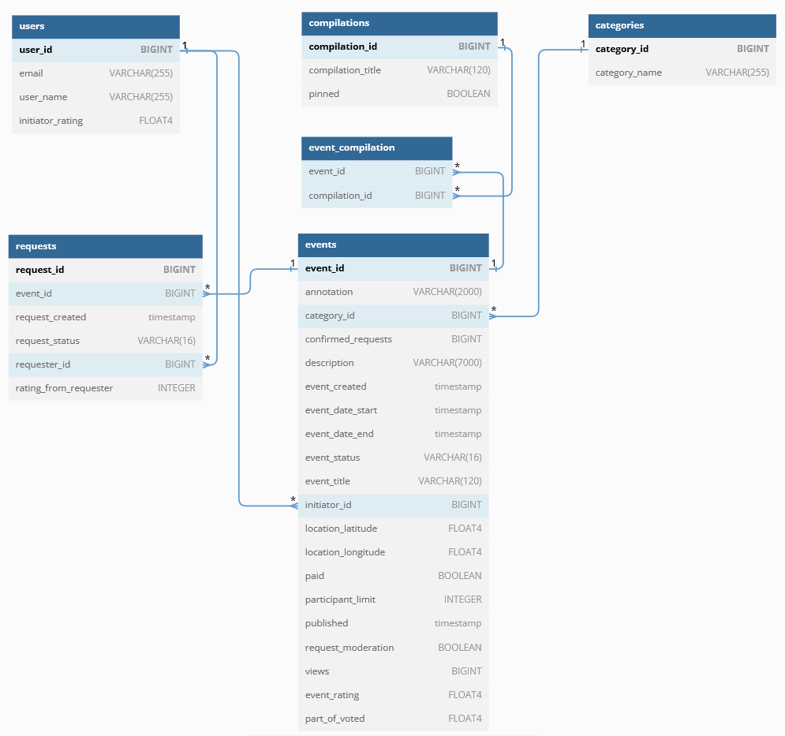

# java-explore-with-me
Coder Alexander Chuchulin

## DB schema

## Дополнительная функциональность - рейтинги событий и их инициаторов.

Оценка событию выставляется участником с подтверждённым статусом участия после завершения события по эндпоинту: 

**PATCH /users/{requesterId}/requests/{requestId}/rating/{rating}**

requesterId - id пользователя сделавшего запрос на участие,
requestId - id его запроса на участие, rating - целое число от 1-10. 1 самая низкая оценка, а 10 - самая высокая.

Для запроса добавлено поле оценка от участника.

Для события добавлены поля: дата окончания события, оценка события, доля проголосовавших

Для пользователя добавлена оценка инициатора.

Для публичного эндпоинта *GET /events добавлено значение requestParam sort **"INITIATOR_RATING"**

При проставлении оценки, её значение записывается в таблице запросов, затем из имеющихся оценок для данного события
рассчитывается средняя оценка и записывается в таблице событий вместе с долей проголосовавших (количество оценок к общему количеству
одобренных запросов для данного события), после этого для инициатора данного события запускается алгоритм расчёта рейтинга инициатора
на основе средневзвешенных оценок всех его завершённых событий. Вес события - сумма участников и количества проголосовавших в данном событии. 
В завершении рейтинг инициатора записывается в таблицу пользователей.

При использовании значения "INITIATOR_RATING" для requestParam sort в публичном эндпоинте *GET /events, будет возвращён список событий
отсортированных по двум параметрам: основная сортировка по рейтингу его инициатора по убыванию, вторичная сортировка по рейтингу события по убыванию.
Оценка события может быть посчитана и отображена только для завершённых событий.